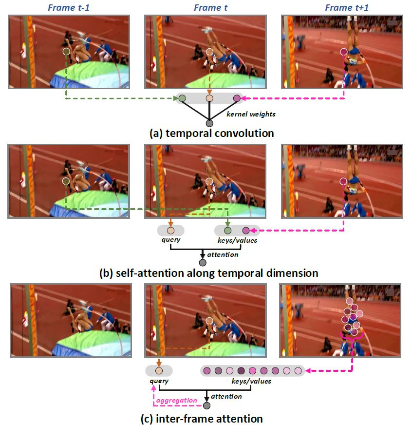

# [CVPR 2022] Stand-Alone Inter-Frame Attention in Video Models

This repository includes the SIFA codes and related configurations. The architecture SIFA-Net and SIFA-Transformer is implemented with python in PyTorch framework. And the kernel of SIFA operation is programmed in C++ with CUDA Library.

The related pre-trained model weigths will be released soon.

# Update 
* 2022.5.8: Repository for SIFA and related training configurations

# Contents:

* [Paper Introduction](#paper-introduction)
* [Required Environment](#required-environment)
* [Compiling of SIFA](#compiling-of-sifa)
* [Training of SIFA](#training-of-sifa)
* [Citation](#citation)

# Paper Introduction
<div align=center>


</div>

Motion, as the uniqueness of a video, has been critical to the development of video understanding models. Modern deep learning models leverage motion by either executing spatio-temporal 3D convolutions, factorizing 3D convolutions into spatial and temporal convolutions separately, or computing self-attention along temporal dimension. The implicit assumption behind such successes is that the feature maps across consecutive frames can be nicely aggregated. Nevertheless, the assumption may not always hold especially for the regions with large deformation. In this paper, we present a new recipe of inter-frame attention block, namely Stand-alone Inter-Frame Attention (SIFA), that novelly delves into the deformation across frames to estimate local self-attention on each spatial location. Technically, SIFA remoulds the deformable design via re-scaling the offset predictions by the difference between two frames. Taking each spatial location in the current frame as the query, the locally deformable neighbors in the next frame are regarded as the keys/values. Then, SIFA measures the similarity between query and keys as stand-alone attention to weighted average the values for temporal aggregation. We further plug SIFA block into ConvNets and Vision Transformer, respectively, to devise SIFA-Net and SIFA-Transformer. Extensive experiments conducted on four video datasets demonstrate the superiority of SIFA-Net and SIFA-Transformer as stronger backbones. More remarkably, SIFA-Transformer achieves an accuracy of 83.1% on Kinetics-400 dataset.

# Required Environment

- python 3.8.0
- Pytorch 1.7
- CUDA 10.1
- cuDNN 8.0
- GPU NVIDIA Tesla V100 (16GB x8)

To guarantee the success of compiling SIFA cuda kernel, the nvcc cuda compiler should be installed in the environment. We have integrated the complete running environment into a docker image and will release it on DockerHub in the future.

# Compiling of SIFA

```
cd ./cuda_sifa
```
Then check the compilation paramter `-gencode=arch` and `code` in the `setup.py` to match the GPU type, e.g., sm_70 for Tesla V100. Then, run
```
bash make.sh
```
If the compilation is successful, the C++ extention file `_ext.cpython-38-x86_64-linux-gnu.so` will be generated in the `./cuda_sifa` folder. Copy it to the main directory.
```
cp _ext.cpython-38-x86_64-linux-gnu.so ../
```

# Training of SIFA

If the frame data has been prepared, please run 
```
python -m torch.distributed.launch --nproc_per_node=4 train_val_3d.py --config_file=settings/c2d_sifa_resnet50-1x16x1.k400.yml
```
or 
```
python -m torch.distributed.launch --nproc_per_node=4 train_val_3d.py --config_file=settings/c2d_sifa_swin-b-1x64x2.k400.yml
```
for the training of SIFA-Net or SIFA-Transformer.

The related training configuration files can be checked in the `.yml` files in the folder of `./base_config/` and `./settings`.


# Citation

If you use these models in your research, please cite:

    @inproceedings{Long:CVPR22,
      title={Stand-Alone Inter-Frame Attention in Video Models},
      author={Fuchen Long, Zhaofan Qiu, Yingwei Pan, Ting Yao, Jiebo Luo and Tao Mei},
      booktitle={CVPR},
      year={2022}
    }